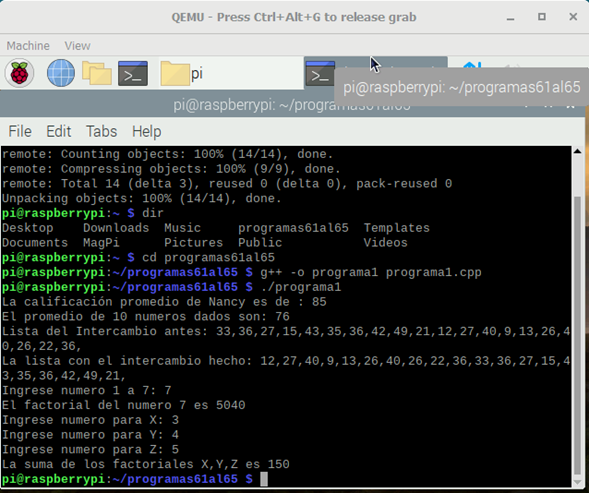

#    Tecnológico Nacional de México
#   Instituto Tecnológico de Tijuana
#        Subdirección Académica

# Departamento de Sistemas y Computación
# Ingeniería en Sistemas Computacionales
# Lenguajes de interfaz 

# Practica Bloque: 2.3  (REPOST) Elabora la QEMU de RaspberryPI virtual y corra sus programas de CPP.
# Objetivo: 


# Mendoza Ramos Christian Javier
# Nu. Control: 18212223
   

# Profesor:
# MC. René Solis Reyes
# Semestre sep - ene 2020

-----
📝 Aqui su trabajo, etc.



```bash
pi@rasperry: ~$ git clone htts//github.com/JavieRM3N/programas61al65.git
Cloning into ‘programas61al65’…
Remote: Enumerating objects: 14, done.
Remote: Counting objects: 100% (14/14), done
Remote: Compressing objects: 100%(9/9), done
Remote: Total 14 (delta 3), reused 0 (delta 0), pack-reused 0
Unpacking objects: 100% (14/14), done
pi@rasperry: ~$ cd programas61al65
pi@rasperry: ~/programas61al65 $ g++ -o programa1 programa1.cpp
pi@rasperry: ~/programas61al65 $ ./programa1
La calificacion promedio de Nancy es de : 85
El promedio de 10 numeros dados son: 76
Lista del Intercambio antes: 33,36,27,15,43,35,36,42,49,21,12,27,40,9,13,26,40,26,22,36
La lista con el intercambio hecho: 12,27,40,9,13,26,40,26,22,36,33,36,27,15,43,35,36,42,49,21
Ingreso numero 1 a 7: 7
El factorial del numero 7 es 5040.
Ingrese numero  X: 3
Ingrese numero Y: 4
Ingrese numero Z:5
La suma de los factoriales X,Y,Z es 150
```


# Es importante conocer a el lenguaje C++ porque es otro lenguaje en el se puede programar al igual que otros distintos


<br />Image by <a href="https://cooltext.com">Cool Text: Logo and Button Generator</a> - <a href="https://cooltext.com/Edit-Logo?LogoID=3664478297">Create Your Own Logo</a>
